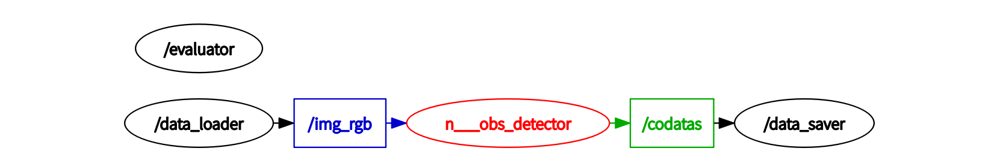
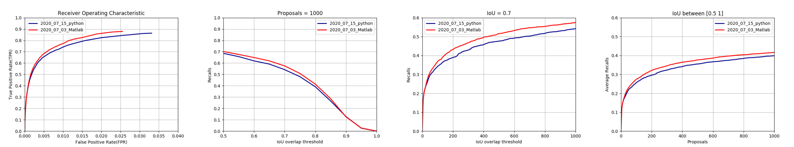

# Tiny-Obstacle-Discovery-ROS

Created by Yicong Chang, Yankai Wang, Fei Sheng, and Feng Xue from BUPT

Official Python/ROS Implementation for "A Novel Multi-layer Framework for Tiny Obstacle Discovery", ICRA 2019

## Introduction

This repository contains the official Python/ROS implementation for "A Novel Multi-layer Framework for Tiny Obstacle Discovery". This paper has been accepted by IEEE International Conference on Robotics and Automation (ICRA) 2019.

**Note:** This version has been slightly different from the Matlab Version, mainly including the following points:

 - The feature, namely mode of edge pixels, is slightly simplified to accelerate the algorithm.
 - For higher efficiency, many modules in this system is implemented in C++.
 - The modules in the system are largely accelerated, although there is still a lot of room for improvement.
 - The performance of this implementation is slightly lower than that of the Matlab implementation

 ## Citation

If you find the paper or the code useful, please cite our paper:

```
@INPROCEEDINGS{Xue_ICRA_2019,
Author = {Feng Xue, Anlong Ming, Menghan Zhou and Yu Zhou},
booktitle={2019 International Conference on Robotics and Automation (ICRA)},
title={A Novel Multi-layer Framework for Tiny Obstacle Discovery},
year={2019},
}
```

## Data Preparation
### Lost and Found Dataset (LAF) [4]

You may download the original images from [here](http://www.dhbw-stuttgart.de/~sgehrig/lostAndFoundDataset/leftImg8bit.zip) and annotations from [here](http://www.dhbw-stuttgart.de/~sgehrig/lostAndFoundDataset/gtCoarse.zip). Then, you will have the following directory structure:
```
lostandfound
|_ leftImg8bit
|  |_ test
|  |  |_ 02_Hanns_Klemm_Str_44
|  |  |_ ...
|  |  |_ 15_Rechbergstr_Deckenpfronn
|  |_ train
|  |  |_ 01_Hanns_Klemm_Str_45
|  |  |_ ...
|  |  |_ 14_Otto_Lilienthal_Str_24
|_ gtCoarse 
|  |_ test
|  |  |_ 02_Hanns_Klemm_Str_44
|  |  |_ ...
|  |  |_ 15_Rechbergstr_Deckenpfronn
|  |_ train
|  |  |_ 01_Hanns_Klemm_Str_45
|  |  |_ ...
|  |  |_ 14_Otto_Lilienthal_Str_24
```

## Before Training and Testing

1. The packages of our environment is listed as follows:
    - Ubuntu 16.04
    - ROS Kinetic
    - Python 3.5.2
    - Numpy 1.18.2
    - Boost_Python 1.58.0
    - OpenCV 3.3.0
    - Matplotlib 3.0.3
    - scikit-learn 0.22.2
    - scipy 1.4.1
    - joblib 0.14.1

2. To avoid the wrong import of OpenCV2 given by ROS, remove `cv2.so` in the ROS's python path : 
```/opt/ros/kinetic/lib/python2.7/dist-packages/cv2.so```

3. Compile the C++ code
```
cd ./pyboostcvconverter
mkdir build
cd build
cmake ..
make -j8
```

4. Copy the file `pbcvt.*` from `./pyboostcvconverter/build/` to `./TOD_ros/src/tod/scripts/tools/`

5. Compile the ROS workspace
```
cd TOD_ros
catkin_make
```
6. If you found some errors in compiling the workspace, please delete "devel", " build", and try again.

## Testing
For testing the algorithm on lost and found dataset, you can run the launch file:
```
cd TOD_ros
source ./devel/setup.bash
roslaunch tod test.launch
```

The graph of ROS can be seen as follows:


**Note for test.launch:** 
- `exp_name` is the name of experiments, it determines the name of final performance file.
- `exp_path` is the path of all experiments files, please set it.

**Note for get_params_LAF.py:**
- `abspath_LAF` is the path of Lost and Found dataset.

## Evaluation

The evaluations will be conducted when all the images are processed.
Eventually, two files recorded the performances are created:
```
./TOD_ros/src/tod/scripts/result/recall/recall_(exp_name).mat
./TOD_ros/src/tod/scripts/result/ROC/ROC_(exp_name).mat
```

#### Option
For visualization, you needs to add performance files into the `ros_names` list and the `recall_names` list in `draw_result.py`, and run the script:
```
cd ./TOD_ros/src/tod/scripts/
python3 draw_result.py
```
The performances are presented as follows:


## Training
If you want to train your own model, run the following code.
```
cd ./TOD_ros/src/tod/scripts/
python3 train_ICRA.py
```

## Reference
```
[1] Dollar P , Zitnick C L . Fast Edge Detection Using Structured Forests[J]. IEEE Transactions on Pattern Analysis & Machine Intelligence, 2015, 37(8):1558-1570.

[2] Zitnick C L , Dollar P . Edge Boxes: Locating Object Proposals from Edges[C]// European Conference on Computer Vision. Springer, Cham, 2014.

[3] Ma J , Ming A , Huang Z , et al. Object-Level Proposals[C]// IEEE International Conference on Computer Vision. IEEE, 2017.

[4] Pinggera P , Ramos S , Gehrig S , et al. Lost and Found: Detecting Small Road Hazards for Self-Driving Vehicles[C]// IEEE/RSJ International Conference on Intelligent Robots and Systems, 2016.
```